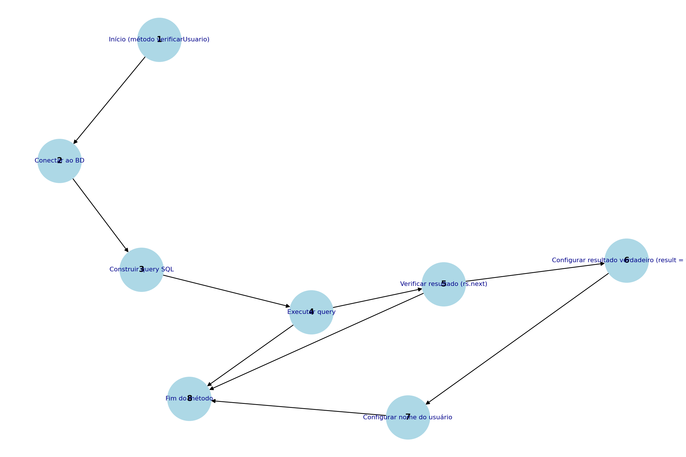

## Erros Identificados

1. **Driver MySQL incorreto**
    - Linha: `Class.forName("com.mysql.Driver.Manager").newInstance();`
    - Correção: Substituir por `Class.forName("com.mysql.cj.jdbc.Driver");`.

2. **URL de conexão inválida**
    - Linha: `String url = "jbdc:mysql://127.0.0.1/test?user=lopes&password=123";`
    - Correção: Substituir `jbdc` por `jdbc`.

3. **Variável de conexão nunca inicializada**
    - O método `conectarBD` não inicializa `conn`. Isso resulta em uma conexão nula.

4. **Vulnerabilidade de SQL Injection**
    - Método: `verificarUsuario`
    - Correção: Utilizar *Prepared Statements* em vez de concatenar strings diretamente.

5. **Falta de fechamento de recursos**
    - Problema: Conexões, `Statement` e `ResultSet` não são fechados, causando vazamento de recursos.
    - Correção: Utilizar `try-with-resources`.

6. **Blocos `catch` vazios**
    - Problema: Exceções não são tratadas nem registradas, dificultando a depuração.
    - Correção: Adicionar mensagens de log ou exibir o *stack trace*.

7. **Ausência de validação de entrada**
    - Problema: Os valores de `login` e `senha` não são validados.
    - Correção: Adicionar validação antes de usá-los na consulta.

## Grafo de Fluxo

O grafo de fluxo do método `verificarUsuario` foi gerado para análise de lógica. Ele pode ser visualizado abaixo:

## Complexidade Ciclomática

A complexidade ciclomática calculada é **3**, utilizando a fórmula: M = E - N + 2P

Onde:
- **E**: Número de arestas (8)
- **N**: Número de nós (8)
- **P**: Número de componentes conectados (1)

**Conclusão:** Existem 3 caminhos básicos independentes no código.

## Caminhos Básicos

Os caminhos básicos encontrados no grafo de fluxo são:

1. **Caminho 1:** 1 → 2 → 3 → 4 → 5 → 6 → 7 → 8
   - Resultado encontrado no banco de dados e processado com sucesso.

2. **Caminho 2:** 1 → 2 → 3 → 4 → 5 → 8
   - Resultado inexistente no banco de dados.

3. **Caminho 3:** 1 → 2 → 3 → 4 → 8
   - Ocorre uma falha ou exceção durante a execução da query.